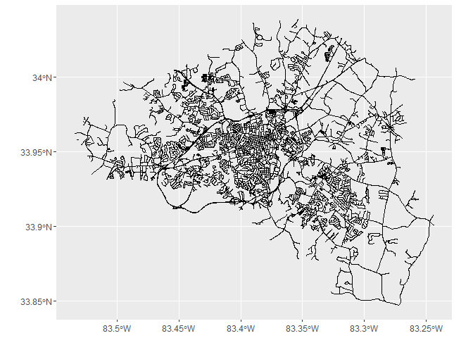
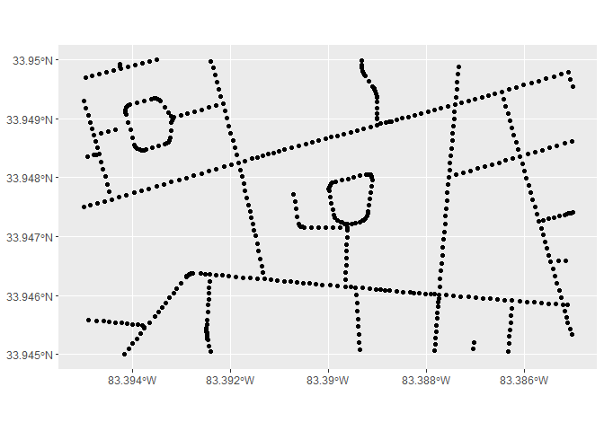
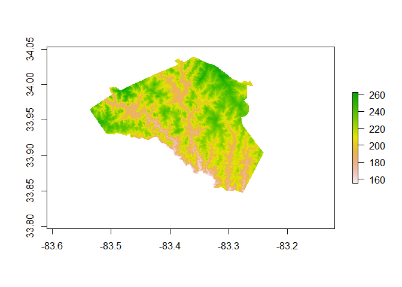
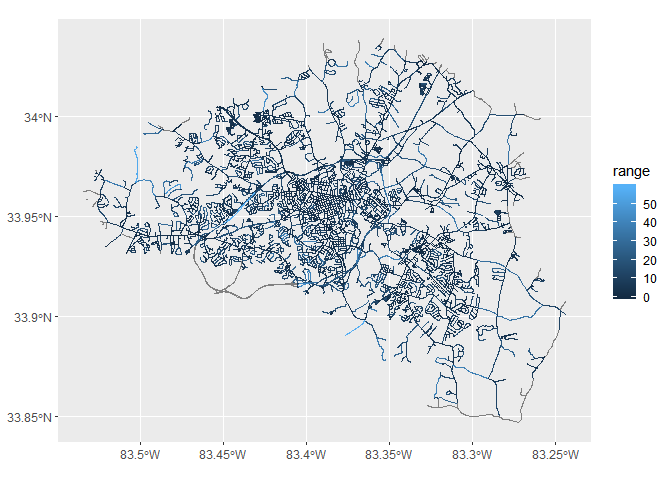
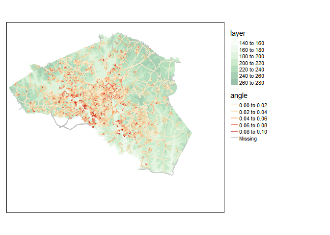

Creating a road elevation map in R
================
Jerry Shannon

## Downloading OSM data

First I loaded road data for Clarke County, which was obtained directly
from the county. This code also includes a method for downloading these
data from OpenStreetMap. I did this using the county boundaries,
creating a bounding box using st\_bbox in sf. We then use
st\_intersection from sf to trim to the Clarke County outline. I add a
road ID field (`L1`) that will be used to join data further down.

``` r
clarke<-st_read("data/US county 2012_Georgia.geojson", quiet=TRUE) %>%
  filter(GEOID==13059)

bbox_clarke<-st_bbox(clarke)

## Code for OSM data below
# roads<-opq(bbox=bbox_clarke) %>%
#   add_osm_feature(key = 'highway') %>%
#   osmdata_sf()
# 
# roads_sf<-roads$osm_lines %>%
#   st_intersection(clarke) %>%
#   select(osm_id,name)

roads_sf<-st_read("data/RoadCenterline.shp") %>%
  st_transform(4326)
```

    ## Reading layer `RoadCenterline' from data source `C:\Users\jshannon\Dropbox\Jschool\Research\Community Mapping Lab\Projects\Athens biking\BikeAthens_CURO_Fall19\data\RoadCenterline.shp' using driver `ESRI Shapefile'
    ## replacing null geometries with empty geometries
    ## Simple feature collection with 6088 features and 31 fields (with 1 geometry empty)
    ## geometry type:  LINESTRING
    ## dimension:      XY
    ## bbox:           xmin: 2488314 ymin: 1400540 xmax: 2576766 ymax: 1470154
    ## epsg (SRID):    NA
    ## proj4string:    +proj=tmerc +lat_0=30 +lon_0=-84.16666666666667 +k=0.9999 +x_0=699999.9999999999 +y_0=0 +datum=NAD83 +units=us-ft +no_defs

``` r
#Add a line number.
roads_sf$L1<-1:nrow(roads_sf)

ggplot(roads_sf) + geom_sf()
```

<!-- -->

Since these line segments vary in length, I used `st_segmentize` to add
additional points to these lines, with a distance of no more than 15
meters between points. To convert these features from to points, we use
st\_cast to change the geometry type and then st\_coordinates to reduce
down to the component points (the vertices of the line segment. The line
number created in the previous chunk (variable `L1`) can be used to join
point attributes back.

``` r
roads_point<-roads_sf %>%
  st_transform(32616) %>%
  st_segmentize(15) %>% 
  st_transform(4326) %>%
  st_cast("MULTIPOINT") %>%
  st_coordinates() %>%
  as_tibble()%>%
  st_as_sf(coords=c("X","Y"),crs=4326,remove=FALSE)

ggplot(roads_point %>%
         filter(X > -83.395 & X < -83.385 &
                  Y > 33.945 & Y < 33.95)) + 
  geom_sf()
```

<!-- -->

Using the `elevatr` package, I can determine the elevation of each
point. First, I used `get_elev_raster` to download a DEM for the study
area. According to the [package
documentation](https://www.rdocumentation.org/packages/elevatr/versions/0.2.0/topics/get_elev_raster),
this DEM is from the Mapzen Terrain Service.

``` r
dem_area<-get_elev_raster(roads_point,z=13) %>%
  mask(clarke)
```

    ## Merging DEMs

    ## Reprojecting DEM to original projection

    ## Note: Elevation units are in meters.
    ## Note: The coordinate reference system is:
    ##  +proj=longlat +datum=WGS84 +no_defs +ellps=WGS84 +towgs84=0,0,0

``` r
raster::plot(dem_area)
```

<!-- -->

Then I determine the elevation value (in meters) for each point using
the `extract` function in raster. This column of values is connected
back to the road points via bind\_cols and then the range is calculated
for each line segment. Lastly, I join this range value back to the road
lines data.

``` r
roads_point_elev<-raster::extract(dem_area,roads_point) %>%
  as_tibble()
```

    ## Warning: Calling `as_tibble()` on a vector is discouraged, because the behavior is likely to change in the future. Use `tibble::enframe(name = NULL)` instead.
    ## This warning is displayed once per session.

``` r
roads_point_elev1<-bind_cols(roads_point,roads_point_elev) %>%
  st_set_geometry(NULL) %>%
  group_by(L1) %>%
  summarise(range=max(value)-min(value))

roads_point_range<-roads_sf %>%
  left_join(roads_point_elev1) 
```

    ## Joining, by = "L1"

``` r
ggplot(roads_point_range) + 
  geom_sf(aes(color=range))
```

<!-- -->

Because lines vary in length, I normalize the change in range by
calculating the distance of each line. I use `st_length` for this
purpose. I use `bind_cols` to connect this back to the main dataset and
then calculate a new variable–angle–that is the ratio of range to
distance. There are some upper outliers for this variable due to short
or very steep hills, and so I top code it based on the value of 1.5 time
the IQR above the third quartile, the standard cutoff for outliers.

``` r
dist<-st_length(roads_point_range) %>%
  as_tibble() %>%
  mutate(distance=as.numeric(value))

roads_point_all<-roads_point_range %>%
  bind_cols(dist) %>%
  mutate(angle=range/distance)

cutoff<-as.numeric(summary(roads_point_all$angle)[5]+(1.5 * IQR(roads_point_all$angle,na.rm=TRUE)))

roads_point_all<-roads_point_all %>%
  mutate(angle=if_else(angle >= cutoff, cutoff,angle))

tm_shape(dem_area)+
  tm_raster(palette="Greens",alpha=0.4)+
tm_shape(roads_point_all)+
  tm_lines("angle",palette="OrRd",lwd=2,alpha=0.7)+
tm_legend(legend.outside=TRUE)
```

    ## Raster object has 14772879 (3597 by 4107) cells, which is larger than 1e+07, the maximum size determined by the option max.raster. Therefore, the raster will be shown at a decreased resolution of 1e+07 cells. Set tmap_options(max.raster = c(plot = 14772879, view = 14772879)) to show the whole raster.

<!-- -->
